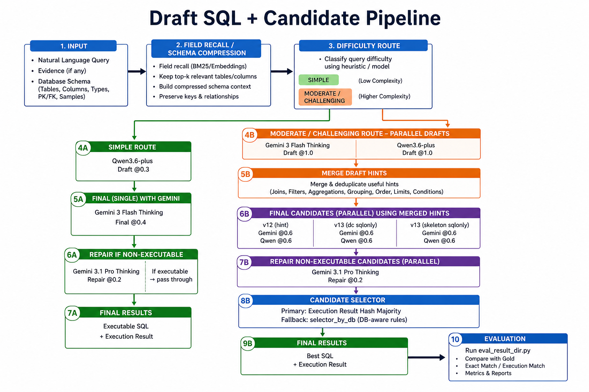
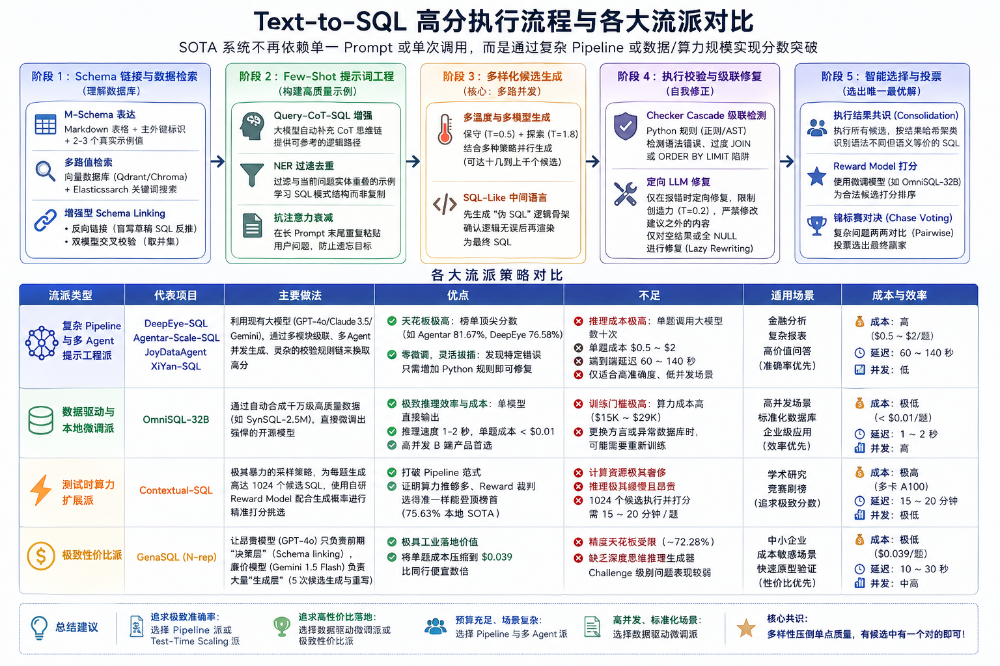

# NL2SQL Draft SQL Candidate Pipeline

A reproducible Text-to-SQL pipeline for schema compression, draft SQL hints,
multi-candidate generation, execution repair, and candidate selection.

The repository contains code, prompt templates, and documentation only. It does
not include BIRD databases, gold SQL files, generated outputs, API keys, or
private evaluation artifacts.

## Pipeline



The high-level route is:

1. Build a gold-free manifest from `test.json`.
2. Render safe stage prompts from `test_tables.json`, optional
   `column_meaning.json`, and database schema metadata.
3. Run field recall / schema compression.
4. Generate draft SQL hints with Gemini and Qwen.
5. Build cross-model final prompts.
6. Generate final candidates with multiple templates and providers.
7. Repair non-executable SQL using local SQLite execution feedback.
8. Select a final SQL using execution result clustering and optional pairwise
   model judging.
9. Export `predict_test.json`.

## NL2SQL Strategy Comparison



## Repository Layout

```text
scripts/draft_sql_candidate_pipeline_20260427/  Main runnable pipeline
field_recall_standalone/                         Schema compression package
templates/                                      Final SQL prompt templates
docs/                                           Design notes and diagrams
checker_pipeline.py                             SQL repair checker cascade
candidate_selector.py                           Execution result selector
```

## Installation

```bash
python -m venv .venv
source .venv/bin/activate
pip install -r requirements.txt
```

## Required Inputs

The official test runner expects BIRD-style files supplied outside the
repository:

```text
test.json
test_tables.json
test_databases/
column_meaning.json        # optional but recommended
```

`test.json` can contain an empty `SQL` field. The test runner does not require
gold SQL.

## API Keys

Keys are read only from environment variables:

```bash
export GEMINI_API_KEY="..."
export DASHSCOPE_API_KEY="..."
# or:
export QWEN_API_KEY="..."
```

No API keys are stored in this repository.

## Run On BIRD-Style Test Data

```bash
TEST_JSON=/path/to/test.json \
TEST_TABLES=/path/to/test_tables.json \
TEST_DATABASES=/path/to/test_databases \
COLUMN_MEANING=/path/to/column_meaning.json \
OUTPUT_DIR=/path/to/output_run \
scripts/draft_sql_candidate_pipeline_20260427/run_test.sh
```

The final output is:

```text
$OUTPUT_DIR/predict_test.json
```

## Data Safety

The runner is designed for API-based evaluation:

- API prompts are rendered without sampled database values.
- `column_meaning.json` is preferred for column descriptions.
- Prompt auditing runs before model calls.
- Generated data and intermediate outputs are written under `OUTPUT_DIR`, which
  is ignored by git by default.

## Documentation

- [Evaluator-facing README](scripts/draft_sql_candidate_pipeline_20260427/README_BIRD_SUBMISSION.md)
- [Selector design](docs/sql_selector_design.md)
- [Temperature guide](docs/nl2sql_temperature_guide.md)
- [Evaluation protocol](docs/evaluation-protocol.md)
- [System comparison](docs/system_vs_top_papers_comparison.md)

## License

MIT License.
